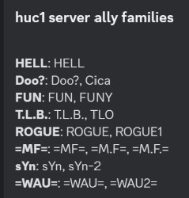

# Family tribes

TribalWars community can set family tribes for each server. This will affect some of the commands if family tribe is enabled.

Remember, everyone can set family tribes! Please use it with care!

The command has three subcommands: add, delete, list

## Add

Add family tribe to global config.

>/family tribe add \<server> \<custom list>

#### Parameters

- server: *Choose a server from the currently running servers. If the server you want not in the list your market is not enabled. Please contact me.   syntax: {market}{server} example: en121 Required: true, Type: string, Autocomplete: true*
- custom list: *This should be set to the tribe(s) tag.  Separated by & you can select more than one syntax: {ally1&ally2} example: HELL&HELL2 Required: true, Type: string, Autocomplete: true*

## Delete

Delete family tribe from global config.

>/family tribe delete \<server> \<family>

#### Parameters

- server: *Choose a server from the currently running servers. If the server you want not in the list your market is not enabled. Please contact me.   syntax: {market}{server} example: en121 Required: true, Type: string, Autocomplete: true*
- family: *This should be set to the tribe(s) tag.  Separated by & you can select more than one syntax: {ally1&ally2} example: HELL&HELL2 Required: true, Type: string, Autocomplete: true*

## List

List family tribes from global config.

>/family tribe list \<server>

#### Parameters

- server: *Choose a server from the currently running servers. If the server you want not in the list your market is not enabled. Please contact me.   syntax: {market}{server} example: en121 Required: true, Type: string, Autocomplete: true*

