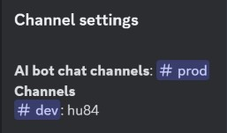

# Channel

*You need "Manage Channels" or "Administrator" permissions to use these commands.*

There are 2 types of world configuration:
    - Global world
    - Channel world

You can set the global world configuration in the guild settings command
[Guild settings](guild_settings.md)

With this command you can set channel world configurations.
You can also set AI chat channels where you can send messages and the bot will answer.

Remember, the bot first checks the channel world, then the global world!

The command has five subcommands: set world, delete world, set ai chat, delete ai chat, list

## Set world

Set world to a channel.

>/channel set world \<server> \<channel>

#### Parameters

- server: *Choose a server from the currently running servers. If the server you want not in the list your market is not enabled. Please contact me.   syntax: {market}{server} example: en121 Required: true, Type: string, Autocomplete: true*
- channel: *Channel ID syntax: {channel_id} example: "123123123" Required: false, Type: channel, Default: interaction channel ID*

## Delete channel

Delete channel or all the set channels world configuration.

>/channel delete world \<channel> \<all>

#### Parameters

- channel: *Channel ID syntax: {channel_id} example: "123123123" Required: false, Type: channel, Default: interaction channel ID*
- all: *Delete all set channels from the server. Required: false, Type: boolean*

## Set AI Chat

Set channel as an AI chat channel

>/channel set ai chat \<channel>

#### Parameters

- channel: *Channel ID syntax: {channel_id} example: "123123123" Required: false, Type: channel, Default: interaction channel ID*

## Delete AI Chat

Delete channel from AI chat channels

>/channel delete ai chat \<channel> \<all>

#### Parameters

- channel: *Channel ID syntax: {channel_id} example: "123123123" Required: false, Type: channel, Default: interaction channel ID*
- all: *Delete all AI channels from the server. Required: false, Type: boolean*

## List

Shows current channel settings.

>/channel list

