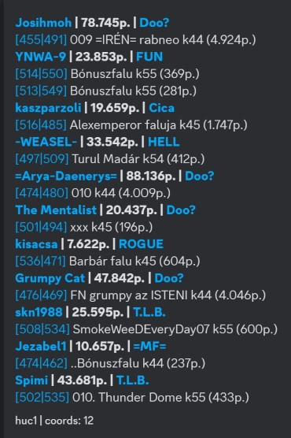

# Coord info

*You need "Manage Channels" or "Administrator" permissions to use these commands.*

This command shows information about villages.
It works without using any command by enabling it. 

The bot first checks all messages for possible coordinates in the following format: 500|500

These coordinates can be inside bigger texts or even several coordinates in one message. The coords are separated by players.

Remember, the bot first checks the channel world, then the global world!

The command has one subcommand: activate

## Activate

Coordinate info activation/deactivation on the server

>/coord info activate \<active>

#### Parameters

- active: *Coordinate info activation/deactivation on the server Required: true, Type: boolean*