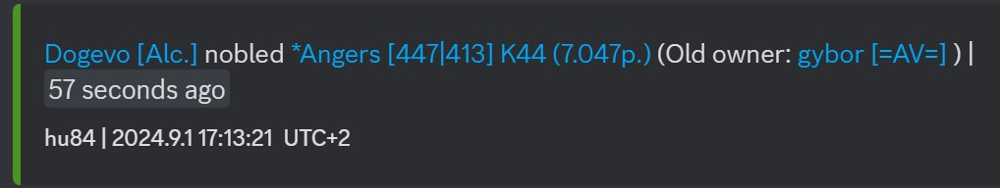
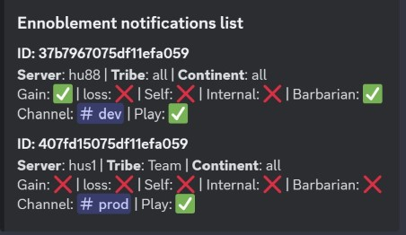

# Live Ennoblements

*You need "Manage Channels" or "Administrator" permissions to use these commands.*

This command allows to set channels as monitor channels, where the bot will post desired conquers every minute.

The command has five subcommands: Add, Delete, Modify, List, Settings

## Add

You need to add a job for each channel or ally. It is recommended to make separate channels for each ally. You can add multiple allies to a job.

>/ennoblements add \<server> \<tribe tag> \<gain> \<loss> \<self> \<internal> \<barbarian> \<continent> \<channel> \<play>

#### Parameters

- server: *Choose a server from the currently running servers. If the server you want not in the list your market is not enabled. Please contact me.   syntax: {market}{server} example: en121 Required: true, Type: string, Autocomplete: true*
- tribe: *This should be set to the tribe(s) you want conquer information about.  Separated by & you can select more than one syntax: {ally1&ally2} example: HELL&HELL2 Required: true, Type: string, Autocomplete: true, Default: all*
- gain: *Show conquers, where the village is taken by the tribe Required: false, Type: boolean, Default: false*
- loss: *Show conquers, where the village gets taken from tribe Required: false, Type: boolean, Default: false*
- barbarian: *Show conquers, where the village taken was a barbarian village Required: false, Type: boolean, Default: false*
- self conquer: *Show conquers, where the original village owner was the same as the taker Required: false, Type: boolean, Default: false*
- internal: *Show conquers, where the original village owner belongs to the same tribe as the taker Required: false, Type: boolean, Default: false*
- continent: *Show conquers, where the village is taken on continent Separated by & you can select more than one syntax: {continent&continent} example: k44&k45 Required: false, Type: string, Autocomplete: true, Default: all*
- channel: *Channel ID where ennoblement notifications sent to syntax: {channel_id} example: "123123123" Required: false, Type: channel, Default: interaction channel ID*
- play: *Monitor activation Required: false, Type: boolean, Default: true*

## Delete

The following command removes the monitors by ID or remove all monitors from the server.
If no parameter is provided then remove all monitors from the current channel

>/ennoblements delete \<job id> \<all>

#### Parameters

- id: *Delete monitor job by id. Autocomplete lists the current jobs set to the server. syntax: {job_id} example: 351f0130b3aa11edb15e Required: false, Type: string, Autocomplete: true*
- all: *Delete all ennoblements monitor jobs from the server. Required: false, Type: boolean*

## Modify

You may need to modify a job later on. With this command you can modify any job set to the server

>/ennoblements modify \<job id> \<server> \<tribe tag> \<gain> \<loss> \<self> \<internal> \<barbarian> \<continent> \<channel> \<play>

#### Parameters

- id: *Modify monitor job by id. Autocomplete lists the current jobs set to the server. syntax: {job_id} example: 351f0130b3aa11edb15e Required: true, Type: string, Autocomplete: true*
- server: *Choose a server from the currently running servers. If the server you want not in the list your market is not enabled. Please contact me.   syntax: {market}{server} example: en121 Required: false, Type: string, Autocomplete: true*
- tribe: *This should be set to the tribe(s) you want conquer information about.  Separated by & you can select more than one syntax: {ally1&ally2} example: HELL&HELL2 Required: false, Type: string, Autocomplete: true*
- gain: *Show conquers, where the village is taken by the tribe Required: false, Type: boolean*
- loss: *Show conquers, where the village gets taken from tribe Required: false, Type: boolean*
- barbarian: *Show conquers, where the village taken was a barbarian village Required: false, Type: boolean*
- self conquer: *Show conquers, where the original village owner was the same as the taker Required: false, Type: boolean*
- internal: *Show conquers, where the original village owner belongs to the same tribe as the taker Required: false, Type: boolean*
- continent: *Show conquers, where the village is taken on continent Separated by & you can select more than one syntax: {continent&continent} example: k44&k45 Required: false, Type: string, Autocomplete: true*
- channel: *Channel ID where ennoblement notifications sent to syntax: {channel_id} example: "123123123" Required: false, Type: channel, Default: interaction channel ID*
- play: *Monitor activation Required: false, Type: boolean*

## List

The following command lists all the monitors set to the server or a specific channel
If no parameter is provided then lists all the monitors set to the server

>/ennoblements list \<channel id>

#### Parameters

- channel: *List channels set to channel ID syntax: {channel_id} example: "123123123" Required: false, Type: channel*

## Settings

With the following command you can configure the style of the notification sent to.

>/ennoblements settings \<use default> \<guest mode> \<village points> \<player points> \<tribe points> \<old owner> \<date time>\<relative time>

#### Parameters

- use default: *Use the globally set default preset Required: false, Type: boolean, Default: true*
- guest mode: *Use of guest mode links Required: false, Type: boolean, Default: false*
- village points: *Show conquered village points Required: false, Type: boolean, Default: true*
- player points: *Show players points Required: false, Type: boolean, Default: false*
- tribe points: *Show tribe points Required: false, Type: boolean, Default: false*
- old owner: *Show old village owner Required: false, Type: boolean, Default: true*
- date time: *Show conquer date and time Required: false, Type: boolean, Default: true*
- relative time: *Show relative time for current time Required: false, Type: boolean, Default: true*