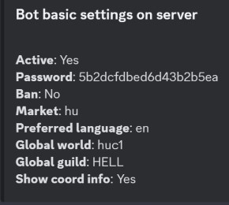

# Guild settings

*You need "Administrator" permission to use these commands.*

You can set the bot discord guild settings as you like on your discord server. If you are not the server owner a password is required in order to change anything.

The command has two subcommands: modify, list

## Modify

Modify basic guild settings.

>/guild settings modify \<active> \<custom list>

#### Parameters

- active: *Bot activation/deactivation on the server Required: false, Type: boolean, Default: true*
- password: *Bot admin password Required: false, Type: string, length: 4-32, Default: custom uuid like string*
- market: *Choose a market from the list. If the market you want not in the list your market is not enabled. Please contact me.   syntax: {market} example: en Required: false, Type: string, Autocomplete: true, Default: guild locale on bot join*
- language: *Preferred language. Choose a language from the list. If the language you want not in the list there is no translation available. Please contact me.   syntax: {language} example: en Required: false, Type: string, Autocomplete: true*
- global world: *Global world on server. Choose a server from the currently running servers. If the server you want not in the list your market is not enabled. Please contact me.   syntax: {market}{server} example: en121 Required: false, Type: string, Autocomplete: true*
- global guild: *Global guild on server. Choose a tribe from the list syntax: {ally_tag} example: HELL Required: false, Type: string, Autocomplete: true*

## List

Shows current global guild settings.

>/guild settings list

