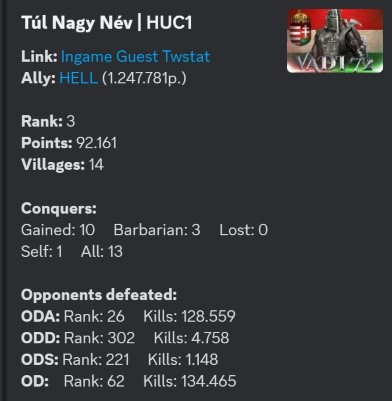
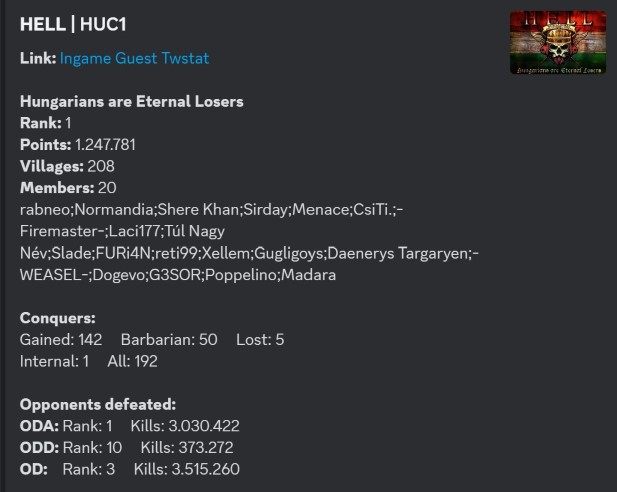
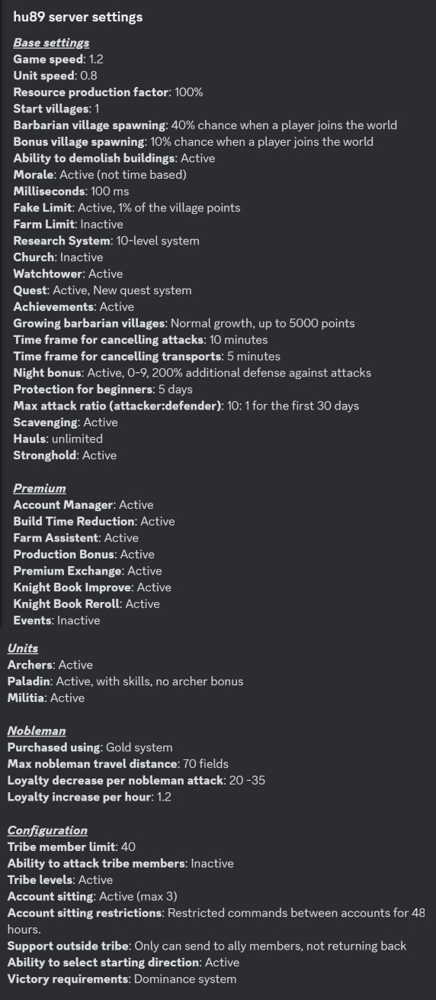

# Info

This command shows information about ally, player and village.
 For all subcommands server parameter is optional! If you did not set a global server to a channel or server then it is required!

The command has four subcommands: player, ally, village, server

## Player

Show information about the player.

>/info player \<player> \<server>

#### Parameters

- player: *Choose a player from the list. syntax: {player name} example: -Sam Required: true, Type: string, Autocomplete: true*
- server: *Choose a server from the currently running servers. If the server you want not in the list your market is not enabled. Please contact me.   syntax: {market}{server} example: en121 Required: false, Type: string, Autocomplete: true*

## Ally

Show information about the ally.

>/info ally \<ally> \<server>

#### Parameters

- ally: *Choose an ally from the list. syntax: {ally id} example: 12 Required: true, Type: string, Autocomplete: true*
- server: *Choose a server from the currently running servers. If the server you want not in the list your market is not enabled. Please contact me.   syntax: {market}{server} example: en121 Required: false, Type: string, Autocomplete: true*

## Village

Show information about the village.

These coordinates can be inside bigger texts or even several coordinates in one message.
 The coords are separated by players.

>/info village \<coord> \<server>

#### Parameters

- coord: *Village coordinate. syntax: {coord} example: 500|500 Required: true, Type: string, Autocomplete: false*
- server: *Choose a server from the currently running servers. If the server you want not in the list your market is not enabled. Please contact me.   syntax: {market}{server} example: en121 Required: false, Type: string, Autocomplete: true*

## Server

Show information about the server settings.
 You can view server configuration translated to your language!

>/info server \<server>

#### Parameters

- server: *Choose a server from the currently running servers. If the server you want not in the list your market is not enabled. Please contact me.   syntax: {market}{server} example: en121 Required: false, Type: string, Autocomplete: true*

