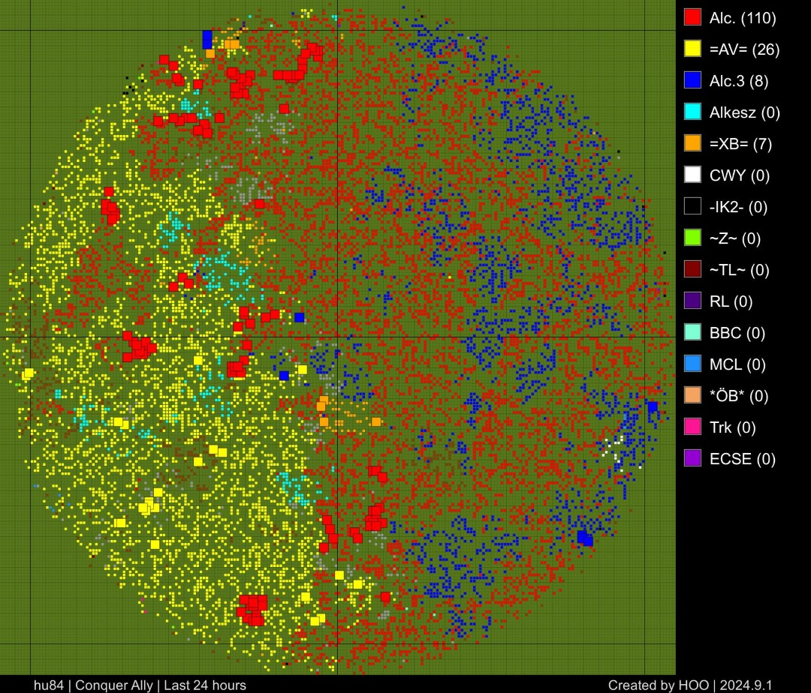
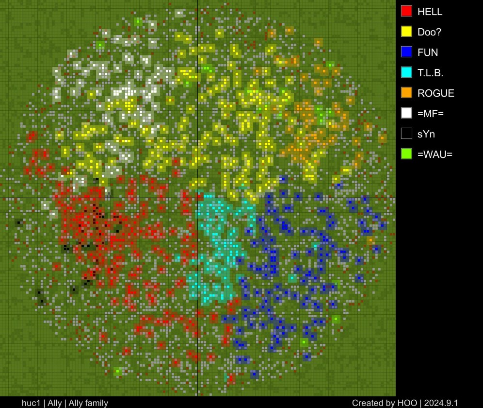
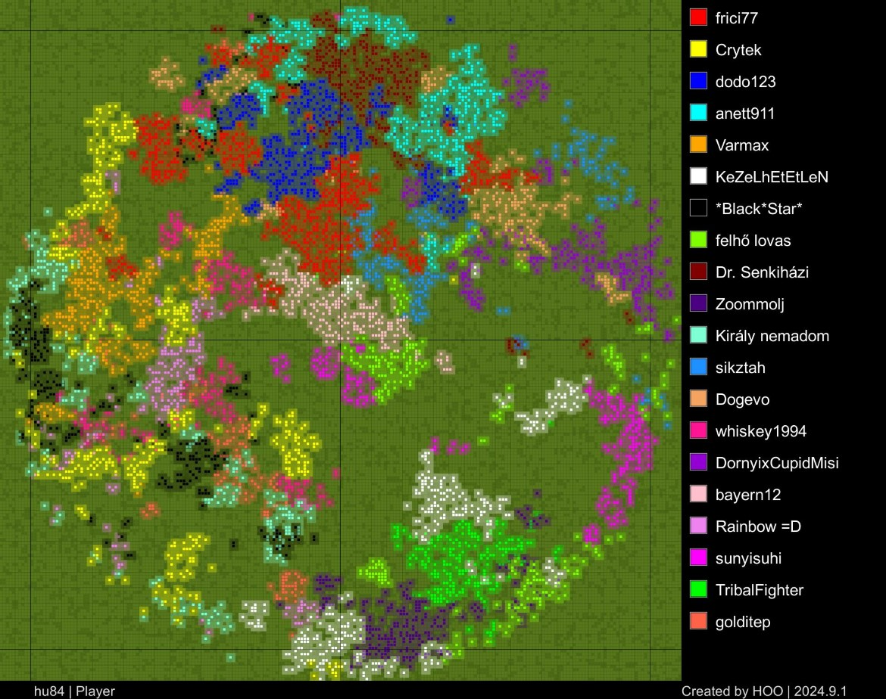

# Map generation

This command generates a custom world map.
You can make maps with many different options.
Ally families are supported. If no ally family is set to the server then uses the default first 15 ally.

The command has three subcommands: Conquer, Ally, Player

## Conquer

Show conquers on the map.
Conquers are marked with bigger rectangles. You can either choose live data or non live data. (Non live data is reverted back to full hour or midnight)
Specific dates can also be used.

>/map conquer \<server> \<type> \<size> \<custom list> \<ally family> \<barbarian> \<player> \<politic> \<vegetation> \<from last x time> \<from> \<to> \<live>

#### Parameters

- server: *Choose a server from the currently running servers. If the server you want not in the list your market is not enabled. Please contact me.   syntax: {market}{server} example: en121 Required: true, Type: string, Autocomplete: true*
- type: *Choose a highlight type. It can be player/ally Required: false, Type: string, Autocomplete: true, Default: ally*
- size: *Amount of data to display Required: false, Type: number, Autocomplete: true, value: 2-20, Default: 15*
- custom list: *This should be set to the tribe(s)/player(s) you want to show on map.  Separated by & you can select more than one syntax: {ally1&ally2} example: HELL&HELL2 Required: false, Type: string, Autocomplete: true*
- ally family: *Use the server ally family setting if available Required: false, Type: boolean, Default: false*
- barbarian: *Show barbarian villages Required: false, Type: boolean, Default: true*
- player: *Show non highlight players Required: false, Type: boolean, Default: true*
- politic: *Show political area Required: false, Type: boolean, Default: false*
- vegetation: *Show trees and other vegetation. Only available below 16 continent servers! Required: false, Type: boolean, Default: false*
- from last x time: *Conquers from last x time to now. X Days Required: false, Type: number, Autocomplete: true, value: 0-30, Default: 1*
- from: *Show conquers from date. example: 2000.01.01 or 01.01.2000, separators supported:  _,./:;- Required: false, Type: string, Autocomplete: false*
- to: *Show conquers till date. example: 2000.01.01 or 01.01.2000, separators supported:  _,./:;- Required: false, Type: string, Autocomplete: false*
- live: *Conquer data live or hourly saved, if last 1 day it resets to midnight Required: false, Type: boolean, Default: true*

## Ally

Show allies on the map

>/map ally \<server> \<size> \<custom list> \<ally family> \<barbarian> \<player> \<politic> \<vegetation>

#### Parameters

- server: *Choose a server from the currently running servers. If the server you want not in the list your market is not enabled. Please contact me.   syntax: {market}{server} example: en121 Required: true, Type: string, Autocomplete: true*
- size: *Amount of data to display Required: false, Type: number, Autocomplete: true, value: 2-20, Default: 15*
- custom list: *This should be set to the tribe(s) you want to show on map.  Separated by & you can select more than one syntax: {ally1&ally2} example: HELL&HELL2 Required: false, Type: string, Autocomplete: true*
- ally family: *Use the server ally family setting if available Required: false, Type: boolean, Default: false*
- barbarian: *Show barbarian villages Required: false, Type: boolean, Default: true*
- player: *Show non highlight players Required: false, Type: boolean, Default: true*
- politic: *Show political area Required: false, Type: boolean, Default: false*
- vegetation: *Show trees and other vegetation. Only available below 16 continent servers! Required: false, Type: boolean, Default: false*

## Player

Show players on the map

>/map player \<server> \<size> \<custom list> \<barbarian> \<player> \<politic> \<vegetation>

#### Parameters

- server: *Choose a server from the currently running servers. If the server you want not in the list your market is not enabled. Please contact me.   syntax: {market}{server} example: en121 Required: true, Type: string, Autocomplete: true*
- size: *Amount of data to display Required: false, Type: number, Autocomplete: true, value: 2-20, Default: 15*
- custom list: *This should be set to the player(s) you want to show on map.  Separated by & you can select more than one syntax: {player1&player2} example: -Sam&HOO Required: false, Type: string, Autocomplete: true*
- barbarian: *Show barbarian villages Required: false, Type: boolean, Default: true*
- player: *Show non highlight players Required: false, Type: boolean, Default: true*
- politic: *Show political area Required: false, Type: boolean, Default: false*
- vegetation: *Show trees and other vegetation. Only available below 16 continent servers! Required: false, Type: boolean, Default: false*

