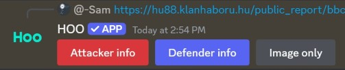
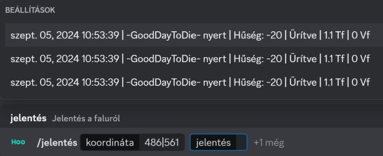
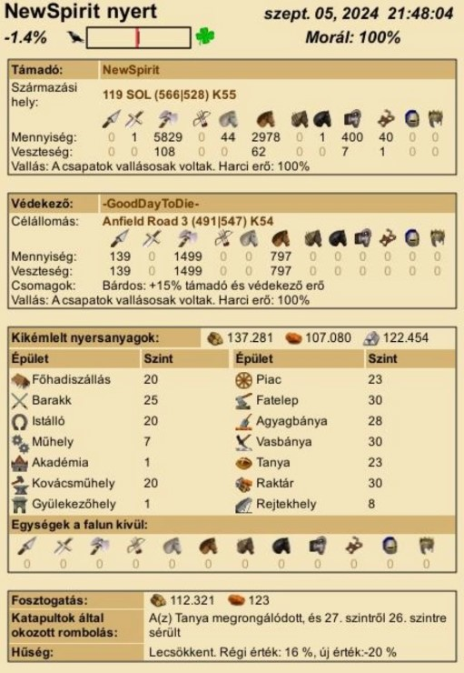

# Report

With this command you can browse the report store database and view specific report or multiple reports of a village.
You can get good information about the village without seeing the report.

To store a report, you simply need to post the public share url/s or mass report format ([report][/report]) format in the chat and the bot will pick it up and store it.

After posting the public share url the bot will send an action row to know whether to save attacker or defender information or just generate a report image without saving into the database.
 Only the author can select the type!
 

Remember, the bot first checks the channel world, then the global world!

Report generation does not support multiple languages, only market language!

>/report \<coord> \<report> \<last x>

#### Parameters

- coord: *Choose a coordinate from the currently stored coordinates. You can search by typing or simply paste the coordinate. syntax: {x}|{y} example: 500|500 Required: true, Type: string, Autocomplete: true, Default: undefined*
- report: *Choose a report from the currently stored reports. syntax: {report timestamp} example: 1726645859972 Required: false, Type: string, Autocomplete: true, Default: last 5 reports*
- last x: *Choose how many reports you want to see from the village. You can type any number between 1-25. syntax: {number} example: 5 Required: false, Type: number, Autocomplete: false, choices: true, Default: last 5 reports*

