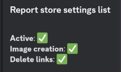

# Report Store

*You need "Manage Channels" or "Administrator" permissions to use these commands.*

With this command you can set the report store configurations and make changes in the database.

To store a report, you simply need to post the public share url/s or mass report format ([report][/report]) format in the chat and the bot will pick it up and store it.

For every coordinate you are allowed to store 25 reports.
If you hit that limit then always the newest 25 reports will be saved and old reports will be deleted!

Remember, the bot first checks the channel world, then the global world!

The command has five subcommands: active, delete, image, delete link, list

## Active

Enable or disable report storing

>/report store activate \<active>

#### Parameters

- active: *Activate report storing. Required: true, Type: boolean, Default: true*

## Delete

Delete specific worlds reports or all stored reports.

>/report store delete  \<server>

#### Parameters

- server: *Choose a server from the currently stored servers. syntax: {market}{server} example: en121 Required: false, Type: string, Autocomplete: true, Default: all servers*

## Image

Enable or disable report image generation from posted links

>/report store image \<active>

#### Parameters

- active: *Activate report image generation. Required: true, Type: boolean, Default: true*

## Delete Link

Delete report link after posting image

>/report store delete link \<active>

#### Parameters

- active: *Delete report link after posting image. Required: true, Type: boolean, Default: true*

## List

Shows current report store settings.

>/report store list

