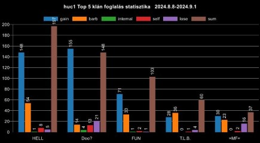

# Statistics / Graph generation

This command allows you to generate statistics.

The command has four subcommands: daily, monthly, od, conquer

## Daily

Creating statistics from the daily achievements.

Be sure to run the command after TribalWars updated the statistics.

It is recommended to use 15 minutes after midnight since the bot has to parse all the data from the site.

>/stat daily \<scope> \<server> \<size> \<ally> \<type> \<style> \<color>

#### Parameters

- scope: *Choose a scope from the list farm + scavenge, farm + village, farm, farmed village, scavenge, conquer, kill att, kill def, kill sup, kill all Required: true, Type: string, Autocomplete: true*
- server: *Choose a server from the currently running servers. If the server you want not in the list your market is not enabled. Please contact me.   syntax: {market}{server} example: en121 Required: true, Type: string, Autocomplete: true*
- size: *Amount of data to display Required: false, Type: number, Autocomplete: true, value: 1-25, Default: 20*
- ally: *This should be set to the tribe you want information about. syntax: {ally1} example: HELL Required: false, Type: string, Autocomplete: true*
- type: *Chart type bar, line, pie, violin Required: false, Type: string, Autocomplete: true, Default: bar*
- style: *Chart style individual, stacked, combined Required: false, Type: string, Autocomplete: true, Default: individual*
- color: *Chart background color Required: false, Type: string, Autocomplete: true, Default: black*

## Monthly

Creating statistics from the pervious months

>/stat monthly \<scope> \<server> \<player> \<ally> \<size> \<month> \<type> \<style> \<color>

#### Parameters

- scope: *Choose a scope from the list Rank - Villages, Rank - Points, Rank - OD, Points - Villages, Villages - OD, Rank, Points, Villages, ODA, ODD, ODS, OD Required: true, Type: string, Autocomplete: true*
- server: *Choose a server from the currently running servers. If the server you want not in the list your market is not enabled. Please contact me.   syntax: {market}{server} example: en121 Required: true, Type: string, Autocomplete: true*
- player: *This should be set to the player you want information about. syntax: {player} example: -Sam Required: false, Type: string, Autocomplete: true*
- ally: *This should be set to the tribe(s) you want information about.  Separated by & you can select more than one syntax: {ally1&ally2} example: HELL&HELL2 Required: false, Type: string, Autocomplete: true*
- size: *Amount of data to display Required: false, Type: number, Autocomplete: true, value: 1-25, Default: 20*
- month: *How many months of data to display Required: false, Type: number, Autocomplete: true, value: 1-12, Default: 1*
- type: *Chart type bar, line, pie, violin Required: false, Type: string, Autocomplete: true, Default: line*
- style: *Chart style individual, stacked, combined Required: false, Type: string, Autocomplete: true, Default: individual*
- color: *Chart background color Required: false, Type: string, Autocomplete: true, Default: black*

## OD

Creating OD stats

>/stat od \<scope> \<server> \<size> \<ally> \<type> \<style> \<color>

#### Parameters

- scope: *Choose a scope from the list kill att, kill def, kill sup, kill all Required: true, Type: string, Autocomplete: true*
- server: *Choose a server from the currently running servers. If the server you want not in the list your market is not enabled. Please contact me.   syntax: {market}{server} example: en121 Required: true, Type: string, Autocomplete: true*
- size: *Amount of data to display Required: false, Type: number, Autocomplete: true, value: 1-25, Default: 20*
- ally: *This should be set to the tribe you want information about.  syntax: {ally} example: HELL Required: false, Type: string, Autocomplete: true*
- type: *Chart type bar, line, pie, violin Required: false, Type: string, Autocomplete: true, Default: bar*
- style: *Chart style individual, stacked, combined Required: false, Type: string, Autocomplete: true, Default: individual*
- color: *Chart background color Required: false, Type: string, Autocomplete: true, Default: black*

## Conquer

Creating conquer / war stats.

Under development, currently only shows the tribe conquer statistics!

>/stat conquer \<server> \<size> \<ally> \<enemy> \<barbarian> \<continent> \<from> \<to> \<type> \<style> \<color>

#### Parameters

- server: *Choose a server from the currently running servers. If the server you want not in the list your market is not enabled. Please contact me.   syntax: {market}{server} example: en121 Required: true, Type: string, Autocomplete: true*
- size: *Amount of data to display Required: false, Type: number, Autocomplete: true, value: 1-25, Default: 20*
- ally: *This should be set to the tribe(s) you want information about.  Separated by & you can select more than one syntax: {ally1&ally2} example: HELL&HELL2 Required: false, Type: string, Autocomplete: true*
- enemy: *This should be set to the tribe(s) you want information about.  Separated by & you can select more than one syntax: {ally1&ally2} example: HELL&HELL2 Required: false, Type: string, Autocomplete: true*
- barbarian: *Show barbarian conquers Required: false, Type: boolean*
- continent: *Show conquers only on this continent syntax: {continent} example: 44 Required: false, Type: Integer, Value: 0-100*
- from: *Show conquers from date. example: 2000.01.01 or 01.01.2000, separators supported:  _,./:;- Required: false, Type: string, Autocomplete: false*
- to: *Show conquers till date. example: 2000.01.01 or 01.01.2000, separators supported:  _,./:;- Required: false, Type: string, Autocomplete: false*
- type: *Chart type bar, line, pie, violin Required: false, Type: string, Autocomplete: true, Default: bar*
- style: *Chart style individual, stacked, combined Required: false, Type: string, Autocomplete: true, Default: individual*
- color: *Chart background color Required: false, Type: string, Autocomplete: true, Default: black*

